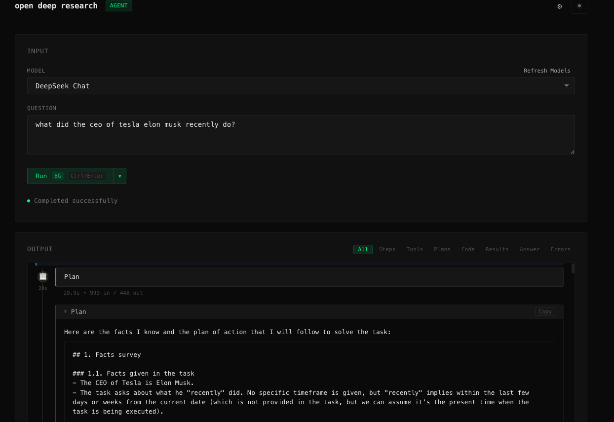
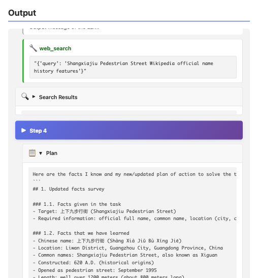
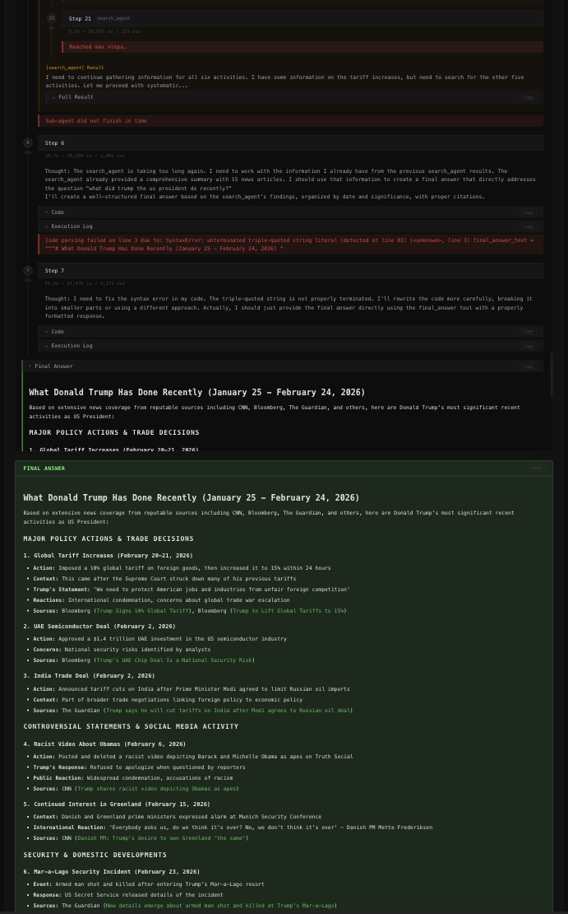

# Open Deep Research

[](https://opensource.org/licenses/Apache-2.0)

Adapted from: https://github.com/huggingface/smolagents/tree/main/examples, added ui and simplified config for **USER FRIENDLY** try outs!!

Welcome to this open replication of [OpenAI's Deep Research](https://openai.com/index/introducing-deep-research/)! This agent attempts to replicate OpenAI's model and achieve similar performance on research tasks.

Read more about this implementation's goal and methods in our [blog post](https://huggingface.co/blog/open-deep-research).


This agent achieves **55% pass@1** on the GAIA validation set, compared to **67%** for the original Deep Research.

## Setup

To get started, follow the steps below:

### Clone the repository

```bash
git clone https://github.com/huggingface/smolagents.git
cd smolagents/examples/open_deep_research
```

### Install system dependencies

The project uses `pydub` and `SpeechRecognition` which require **FFmpeg** for audio processing and format conversion.

**Install FFmpeg:**

- **macOS**: `brew install ffmpeg`
- **Linux**: `sudo apt-get install ffmpeg`
- **Windows**: Download from [ffmpeg.org](https://ffmpeg.org/download.html) or `choco install ffmpeg`

Verify installation: `ffmpeg -version`

### Create virtual environment and install dependencies

```bash
python3 -m venv venv
source venv/bin/activate  # On Windows: venv\Scripts\activate
pip install -e .
```

For development tools (testing, linting, type checking):

```bash
pip install -e ".[dev]"
```

### Set up environment variables

Create a `.env` file from the `.env.example` template and configure the following variables:

**Required:**
- `OPENAI_API_KEY` - For the visual QA tool (image analysis) and if using OpenAI models
  - [Sign up here to get a key](https://platform.openai.com/signup)

**Optional:**
- `HF_TOKEN` - Only required for `run_gaia.py` (for downloading datasets)
  - [Get your token here](https://huggingface.co/settings/tokens)
- `META_SOTA_API_KEY` - For MetaSo search engine (alternative to DuckDuckGo)
  - [Get your API key from MetaSo](https://metaso.cn)

**Search Engine Configuration:**

The project supports multiple search engines via the `SEARCH_ENGINE` environment variable:

- **DuckDuckGo (DDGS)** - Default, no API key required
  ```bash
  SEARCH_ENGINE=DDGS
  ```

- **MetaSo (META_SOTA)** - Requires `META_SOTA_API_KEY`
  ```bash
  SEARCH_ENGINE=META_SOTA
  META_SOTA_API_KEY=your_api_key_here
  ```

- **Multiple engines with fallback** - Use comma-separated values
  ```bash
  SEARCH_ENGINE=META_SOTA,DDGS  # Try MetaSo first, fallback to DuckDuckGo
  ```

The agent will use the configured search engine(s) in order, with automatic fallback if one fails or is unavailable.

**Model selection:**
Depending on the model you want to use, set the corresponding environment variables:
- For `o1` model (default): `OPENAI_API_KEY` required
- For other OpenAI-compatible models: Follow the provider's documentation
- For local models (Ollama, LM Studio): No API key required

> [!WARNING]
> The use of the default `o1` model is restricted to tier-3 access: https://help.openai.com/en/articles/10362446-api-access-to-o1-and-o3-mini


## Usage

Make sure your virtual environment is activated and environment variables are set.

### Command Line Interface

```bash
python run.py --model-id "o1" "Your question here!"
```

Or use other models via LiteLLM:

```bash
python run.py --model-id "ollama/mistral" "Your question here!"
python run.py --model-id "claude-3-5-sonnet-20241022" "Your question here!"
```

### Web UI (Recommended)

The web UI provides:
- 🎨 Modern, responsive interface
- 📝 Question input form
- 🤖 Model selection dropdown
- 📊 Real-time streaming output with collapsible sections
- ⏹️ Stop button (kills process immediately)
- 🔄 Auto-cancellation when submitting new questions

**Screenshots:**

<div align="center">
  
  <p><em>Clean input interface with model selection</em></p>

  
  <p><em>Real-time display of agent reasoning, tool calls, and observations</em></p>

  
  <p><em>Highlighted final answer with collapsible sections</em></p>
</div>

#### Development Mode

Start the development server:

```bash
python web_app.py
```

Then open your browser to `http://localhost:5080`

You can customize the server:

```bash
python web_app.py --port 8000 --host 0.0.0.0
```

#### Production Mode

For production deployments, use Gunicorn:

```bash
# Install dependencies (including gunicorn)
pip install -e .

# Run with gunicorn
gunicorn -c gunicorn.conf.py web_app:app

# Or with custom settings
gunicorn --bind 0.0.0.0:5080 --workers 4 --timeout 300 web_app:app
```

The included `gunicorn.conf.py` is pre-configured with:
- Multi-worker process management
- 300s timeout for long-running agent tasks
- Proper logging and error handling
- Auto-restart on code changes (during development)

### Docker Deployment

For containerized deployment, use Docker or Docker Compose:

#### Option 1: Docker Compose (Recommended)

```bash
# 1. Make sure .env file is configured with your API keys
cp .env.example .env
# Edit .env with your actual API keys

# 2. Build and run
docker-compose up -d

# 3. View logs
docker-compose logs -f

# 4. Stop
docker-compose down
```

#### Option 2: Docker Run

```bash
# Build image
docker build -t open-deep-research .

# Run with environment variables
docker run -d \
  -e OPENAI_API_KEY=your_key_here \
  -e DEEPSEEK_API_KEY=your_key_here \
  -e META_SOTA_API_KEY=your_key_here \
  -e SEARCH_ENGINE=META_SOTA,DDGS \
  -p 5080:5080 \
  --name open-deep-research \
  open-deep-research

# Or use --env-file
docker run -d \
  --env-file .env \
  -p 5080:5080 \
  --name open-deep-research \
  open-deep-research
```

**Important Security Notes:**
- Never commit `.env` file with real API keys to git
- Never bake API keys into Docker images
- Always pass secrets at runtime using `-e` flags or `--env-file`

### GAIA Benchmark Evaluation

For the GAIA benchmark evaluation:

```bash
python run_gaia.py --model-id "o1" --run-name my-run
```

## Full reproducibility of results

The data used in our submissions to GAIA was augmented in this way:
 -  For each single-page .pdf or .xls file, it was opened in a file reader (MacOS Sonoma Numbers or Preview), and a ".png" screenshot was taken and added to the folder.
- Then for any file used in a question, the file loading system checks if there is a ".png" extension version of the file, and loads it instead of the original if it exists.

This process was done manually but could be automatized.

After processing, the annotated was uploaded to a [new dataset](https://huggingface.co/datasets/smolagents/GAIA-annotated). You need to request access (granted instantly).

## License

This project is licensed under the **Apache License 2.0** - the same license as the original [smolagents](https://github.com/huggingface/smolagents) repository to honor the open-source contributions of the HuggingFace team.

See the [LICENSE](LICENSE) file for details.

**Acknowledgments:**
- Original implementation by HuggingFace [smolagents](https://github.com/huggingface/smolagents)
- Web UI, process-based architecture, and security enhancements added in this fork